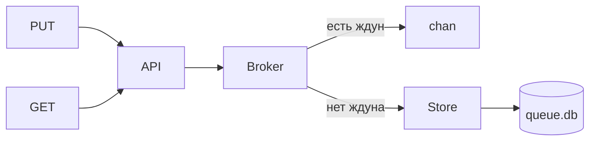

# Queue broker

Мини-сервис очередей: **FIFO**, блокирующий **GET** с **`timeout`**, порядок выдачи ждущим клиентам как в ТЗ. Персистенция — **SQLite** (через `modernc.org/sqlite`, без CGO).

```text
PUT  /{queue}?v=message   → 200 пусто | 400 без v
GET  /{queue}             → 200 + тело | 404 пусто
GET  /{queue}?timeout=N   → ждать до N секунд, иначе 404
```

## Быстрый старт

`go.mod` лежит в **корне репозитория** (на уровень выше этой папки). Откуда запускаешь — такой и путь:

| Где ты сейчас | Запуск |
|---------------|--------|
| корень репо (`…/developing/`) | `go run ./testproject 8080` |
| эта папка (`…/developing/testproject/`) | `go run . 8080` |

Очередь по умолчанию пишется в **`queue.db`** в **текущей рабочей директории** процесса (откуда вызвал `go run`).

## Архитектура (коротко)

| Слой | Роль |
|------|------|
| `internal/api` | HTTP: путь = имя очереди, валидация `v` / `timeout` |
| `internal/broker` | FIFO в памяти для **ждунов** + мост к хвосту в БД |
| `internal/store` | SQLite: только «лежит в очереди», пока никто не ждёт |

Инвариант: если есть ожидающие **GET** с `timeout`, хвост в БД для этой очереди пуст — иначе следующий **GET** забрал бы сообщение без блокировки.



## Тесты

```bash
# из корня репозитория (рядом с go.mod)
go test -race -count=1 ./testproject/tests/...

# из папки testproject/ (как у тебя в терминале) — без префикса testproject/
go test -race -count=1 ./tests/...
```

- **`tests/integration`** — HTTP end-to-end (сценарий из ТЗ, два ждуна, конкурентные PUT, негативы).
- **`tests/store`** — контракт SQLite (порядок, изоляция очередей, гонка на одну строку).
- **`tests/testutil`** — общий `httptest` + БД для тестов.

## Соответствие ТЗ

| Требование | Статус |
|------------|--------|
| PUT /queue?v=…, пустой v → 400 | ✅ |
| GET FIFO, пусто → 404 | ✅ |
| GET ?timeout=N (секунды), таймаут → 404 | ✅ |
| Два ждуна — кто раньше запросил, тому первое сообщение | ✅ |
| Порт из аргумента CLI | ✅ |
| Только stdlib | ⚠️ добавлен **SQLite** драйвер (осознанно, для персистенции) |

## Graceful shutdown

`SIGINT` / `SIGTERM` → `Shutdown` с дедлайном, `BaseContext` рвёт долгие **GET** при остановке.

